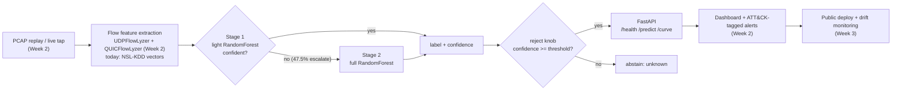

# FlowSentry

Real-time hierarchical intrusion detection with a tunable reject option. A two-stage flow
classifier (cheap model first, escalate uncertain flows to a heavier one) that abstains with
"unknown" instead of guessing, served over FastAPI. It operationalizes the architecture from my
accepted SECRYPT 2026 paper on hierarchical UDP/QUIC intrusion detection.

> **Data note, read this first.** Every number below is measured on **NSL-KDD**, the standard
> public benchmark, so anyone can reproduce and compare. NSL-KDD is deliberately **not** the
> headline dataset. The headline system, flows extracted by my own UDPFlowLyzer / QUICFlowLyzer
> analyzers on the BCCC-UDP-Cloud-DDoS-2024 data, with a live public deploy and a real-time
> dashboard, is the Week 2 / Week 3 roadmap below and is **not built yet**.

## Why a reject option

Most IDS demos report one accuracy number and answer every flow, confident or not. In a SOC that
is exactly wrong: a low-confidence guess on a rare attack class is worse than an honest "unknown,
send to a human or a deeper detector." FlowSentry makes that trade-off a tunable, measured knob:
sweep the reject threshold and you get a coverage-vs-reliability curve instead of a single number.
On NSL-KDD that knob moves reliability from 71.5% (answer everything) to 94.6% (answer the 24.7%
of flows the model is sure about). That curve is the product.

## Architecture



Built today: the two-stage model with the reject knob, the leakage-safe benchmark evaluation, and
the FastAPI service. The extractor layer, dashboard, and deploy are roadmap.

## Results (real, measured)

Dataset: NSL-KDD public benchmark, official split. KDDTrain+ 125,973 rows, KDDTest+ 22,544 rows,
122 features after one-hot encoding, 5 classes (dos, normal, probe, r2l, u2r). The preprocessor is
fit on train only, and KDDTest+ contains attack subtypes absent from training, so this is a
leakage-safe, novelty-aware evaluation by construction.

**Full coverage (no abstain): accuracy 71.5%, macro-F1 0.457.**

| Class | F1 |
|---|---|
| dos | 0.81 |
| normal | 0.76 |
| probe | 0.68 |
| r2l | 0.02 |
| u2r | 0.03 |

Yes, r2l and u2r are near zero. That is the well-known hard part of NSL-KDD: extreme class
imbalance plus novel attack subtypes that only appear in the test set. The many notebooks that
report 99% on this dataset typically evaluate on a random split of the training file, which leaks.
71.5% on the official split is the honest number, and the reject option is the engineering answer
to it: abstain on the uncertain rare-class flows instead of bluffing.

**Coverage vs reliability (the reject knob working).** Reliability = accuracy on the flows the
model chose to answer. Stage 1 escalates 47.5% of flows to stage 2.

| Reject threshold | Coverage | Reliability | Flows answered |
|---|---|---|---|
| 0.00 | 100% | 71.5% | 22,544 |
| 0.50 | 99.0% | 71.8% | 22,320 |
| 0.60 | 96.7% | 73.1% | 21,788 |
| 0.70 | 94.3% | 74.5% | 21,260 |
| 0.80 | 89.7% | 75.6% | 20,230 |
| 0.90 | 82.0% | 81.0% | 18,493 |
| 0.95 | 31.6% | 83.1% | 7,133 |
| 0.99 | 24.7% | 94.6% | 5,575 |

Source: `artifacts/metrics.json`, regenerated by every training run. Full detail and limitations in
[docs/MODEL_CARD.md](docs/MODEL_CARD.md). Latency: to be measured under load (Week 3), no claims
until then.

## Quickstart

```bash
git clone https://github.com/Aeripsen/flowsentry
cd flowsentry
python -m venv .venv
source .venv/bin/activate        # Windows: .venv\Scripts\activate
pip install -r requirements.txt
pip install -e .

python scripts/get_data.py       # fetch NSL-KDD (~19 MB)
python -m flowsentry.train       # train + write artifacts/metrics.json (a few minutes)
uvicorn flowsentry.service:app   # serve on http://localhost:8000
pytest                           # run the test suite
```

Docker: the Dockerfile lands with the Week 2 pipeline milestone. The path will be
`docker build -t flowsentry . && docker run -p 8000:8000 flowsentry`.

## API

| Endpoint | Method | What it does |
|---|---|---|
| `/health` | GET | liveness + whether a trained model is loaded |
| `/predict` | POST | classify one flow, reject knob as a request field |
| `/curve` | GET | the measured coverage-vs-reliability curve from the last train run |

```bash
curl -s -X POST http://localhost:8000/predict \
  -H "Content-Type: application/json" \
  -d '{
        "features": {"protocol_type": "tcp", "service": "http", "flag": "SF",
                     "src_bytes": 181, "dst_bytes": 5450,
                     "count": 8, "srv_count": 8, "same_srv_rate": 1.0},
        "reject_threshold": 0.9
      }'
```

The response has four fields: `label` (one of the 5 classes, or `unknown` when the model
abstains), `confidence` (final-stage confidence), `escalated_to_stage2` (whether stage 1 punted),
and `abstained` (whether the reject knob fired). Missing numeric features default to 0, missing
categoricals to `"other"`.

## Roadmap

**Week 1: offline core + serving (DONE)**
- [x] Two-stage reject classifier with the coverage-reliability curve (`src/flowsentry/model.py`)
- [x] Leakage-safe NSL-KDD evaluation on the official KDDTrain+/KDDTest+ split
- [x] FastAPI service: `/health`, `/predict` with the reject knob, `/curve`
- [x] Tests (model behavior + service) and the measured metrics artifact

**Week 2: real feature layer + real-time pipeline (not built)**
- [ ] Swap the feature layer to my own UDPFlowLyzer + QUICFlowLyzer extractors, so the two stages
      run genuinely different feature sets (UDP-only, then QUIC-augmented) as in the paper
- [ ] Headline dataset: BCCC-UDP-Cloud-DDoS-2024 (once officially public)
- [ ] Replay -> extractor -> stream -> model real-time pipeline with measured latency
- [ ] Live dashboard with the reject-knob slider (coverage vs reliability, live)
- [ ] Dockerfile + containerized runs
- [ ] MITRE ATT&CK mapping per attack class + SIEM-style alert feed

**Week 3: deploy + hardening (not built)**
- [ ] Public deploy with a live URL
- [ ] Drift monitoring and ops metrics
- [ ] Load test with real measured latency and throughput numbers
- [ ] Adversarial probe: perturbed flows vs the reject knob (see [docs/THREAT_MODEL.md](docs/THREAT_MODEL.md))
- [ ] Walkthrough video + engineering trade-offs writeup

## Attribution

- The two-stage hierarchical UDP/QUIC IDS with a reject option is the architecture from my
  peer-reviewed paper, accepted at **SECRYPT 2026** (hierarchical ML UDP-QUIC intrusion
  detection). This repo is that idea turned into a running, testable service.
- **UDPFlowLyzer** and **QUICFlowLyzer** (the Week 2 feature layer) are my own public flow
  extractors, built on the **NTLFlowLyzer** base by Rezvan Shafi.
- **NSL-KDD** is a public benchmark from the Canadian Institute for Cybersecurity.
- Built with scikit-learn, pandas, FastAPI, and pydantic.

## License

MIT, see [LICENSE](LICENSE).
