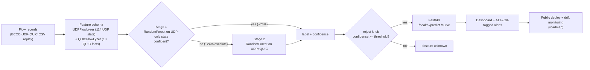

# FlowSentry

Per-flow hierarchical UDP/QUIC intrusion detection with a tunable reject option, served over
FastAPI. Stage 1 is a fast model on UDP flow statistics; flows it cannot classify confidently are
escalated to a Stage 2 model that adds QUIC-specific features; a separate reject knob lets the
system abstain ("unknown") instead of guessing. It operationalizes the architecture from my
accepted **SECRYPT 2026** paper on hierarchical UDP/QUIC intrusion detection, on that paper's own
dataset.

> **Data note, read this first.** Every number below is measured on the **real
> BCCC-UDP-QUIC-IDS-2025 dataset** (CC BY 4.0), the dataset from my SECRYPT 2026 paper. Flows were
> extracted from cloud PCAP captures by my own analyzers, **UDPFlowLyzer** (UDP flow statistics)
> and **QUICFlowLyzer** (QUIC metadata). The repo ships a **stratified sample of the public
> dataset** (`data/sample/bccc_udp_quic_sample.csv.gz`, 25,615 flows) so the whole pipeline
> reproduces from a clean clone without the multi-GB download. This is a per-flow classification
> service, not a live network tap: it classifies stored flow records, so nothing here is described
> as "real-time."

## Why a reject option

Most IDS demos report one accuracy number and answer every flow, confident or not. In a SOC that
is exactly wrong: a low-confidence guess on a rare attack family is worse than an honest "unknown,
send to a human or a deeper detector." FlowSentry makes that trade-off a tunable, measured knob:
sweep the reject threshold and you get a coverage-vs-reliability curve instead of a single number.
On the held-out test split the knob moves reliability from **83.2%** (answer everything) to
**99.3%** (answer the ~65% of flows the model is sure about). That curve is the product.

## Architecture



Built today: the two-stage model with the reject knob (Stage 1 on the **named UDP flow-statistics**
feature set, Stage 2 adding the **named QUIC** feature set, see Results), the leakage-safe
connection-grouped evaluation, the FastAPI service, the per-flow replay pipeline with measured
latency (`src/flowsentry/stream.py`), the Streamlit dashboard, Docker, and the MITRE ATT&CK
class-level mapping. The public deploy and drift monitoring are roadmap.

## Feature sets (defensible by name, not a positional slice)

- **Stage 1 (UDP-only), 114 features** from UDPFlowLyzer: packet/byte counts, `pps`/`bps` rates,
  inter-arrival-time statistics (`mean_iat`, `iat_std`, `iat_entropy`, ...), burst/idle structure,
  packet-size distribution moments and percentiles, entropy features, and directional asymmetry.
  These are cheap and present on *every* UDP flow, so Stage 1 can answer most flows on its own.
- **Stage 2 (UDP + QUIC), 132 features**: the 114 UDP features plus 18 QUICFlowLyzer features
  (`has_quic_subflow`, `quic_match_count`, `quic_*` handshake/timing/path-migration signals). QUIC
  parsing is more expensive and only meaningful for QUIC-carrying flows, so Stage 2 runs only when
  Stage 1 is unsure. The exact names are in `src/flowsentry/data.py` (`UDP_FEATURES`,
  `QUIC_FEATURES`). Ports and IPs are deliberately **excluded** from the model to avoid trivial
  shortcuts; they are used only to build the connection key for the leakage-safe split.

## Results (real, measured)

Dataset: BCCC-UDP-QUIC-IDS-2025, the committed 25,615-flow stratified sample (benign + 7 named UDP
DDoS families; all rare-family flows kept, benign and UDP-RAW capped). **Leakage-safe split:**
`GroupShuffleSplit` on the UDP 5-tuple connection, so no flow from one connection appears in both
train and test; the median imputer is fit on train only. Reproduced by every `python -m
flowsentry.train` run (`random_state=42`).

**Binary DDoS detection (benign vs attack), PR-AUC = 0.977.** Benign-detection PR-AUC = 0.954.
**Full-coverage accuracy = 83.2%, macro-F1 = 0.391** across the 8 classes.

Per-family (PR-AUC / F1 on the test split):

| Class | PR-AUC | F1 |
|---|---|---|
| UDP-RAW | 0.999 | 0.995 |
| benign | 0.954 | 0.820 |
| UDP-VSE | 0.426 | 0.481 |
| UDP-MULTI | 0.306 | 0.358 |
| UDP-HULK | 0.147 | 0.242 |
| UDP-GAME | 0.082 | 0.164 |
| UDP-OVH | 0.045 | 0.027 |
| UDP-bypass-v1 | 0.042 | 0.041 |

The dominant flood (UDP-RAW) and benign traffic separate cleanly; the rare campaign variants
(200-400 flows each, and all volumetric UDP floods that look alike at the flow level) are genuinely
hard, which is why full-coverage macro-F1 is modest. That is the honest picture, and the reject
option is the engineering answer to it: abstain on the uncertain rare-flow tail instead of bluffing.

**Coverage vs reliability (the reject knob working).** Reliability = accuracy on the flows the model
chose to answer. Stage 1 escalates 24.3% of flows to Stage 2.

| Reject threshold | Coverage | Reliability | Flows answered |
|---|---|---|---|
| 0.00 | 100.0% | 83.2% | 6,570 |
| 0.50 | 87.6% | 93.6% | 5,752 |
| 0.70 | 81.9% | 97.5% | 5,379 |
| 0.80 | 79.2% | 98.1% | 5,202 |
| 0.90 | 76.6% | 98.6% | 5,035 |
| 0.95 | 73.0% | 99.0% | 4,793 |
| 0.99 | 64.8% | 99.3% | 4,255 |

**Ablation (is the hierarchy worth it?).** A single 200-tree RF on the full UDP+QUIC space scores
the same full-coverage macro-F1 (0.391) and accuracy (0.832) as the two-stage model, so the
hierarchy is a full-coverage *tie* on raw accuracy (consistent with the paper). Its value is
elsewhere: (1) the tunable reject knob above, and (2) efficiency, Stage 1 answers ~76% of flows
using only the cheap UDP features, so the expensive QUIC-augmented Stage 2 runs on the ~24% it
cannot resolve.

Source: `artifacts/metrics.json`, regenerated by every training run. Full detail and limitations in
[docs/MODEL_CARD.md](docs/MODEL_CARD.md).

**Throughput (measured, honest).** `python -m flowsentry.stream` classifies flows one at a time the
way the service sees a single request. On the development machine that is ~20 flows/s single-thread
(mean 49 ms/flow, p95 108 ms, p99 129 ms). This is a per-flow batch loop, not a throughput-optimized
or async pipeline, and it is not a live tap, so nothing here is described as real-time. Batching and
concurrency are a deliberate later optimization, not hidden.

## Quickstart

```bash
git clone https://github.com/Aeripsen/flowsentry
cd flowsentry
python -m venv .venv
source .venv/bin/activate        # Windows: .venv\Scripts\activate
pip install -e .                 # installs the package + runtime deps

python -m flowsentry.train       # trains on the committed BCCC sample, writes artifacts/ (~30 s)
uvicorn flowsentry.service:app   # serve on http://localhost:8000
pytest                           # run the test suite
```

The BCCC sample ships in the repo, so there is no dataset download step. Docker (self-contained:
trains inside the build from the committed sample, so a clean clone always gets a working
`/predict`):

```bash
docker build -t flowsentry .
docker run -p 8000:8000 flowsentry
# or, for the API + dashboard together:
docker compose up --build
```

## Dashboard

`dashboard/app.py` is a Streamlit dashboard whose centerpiece is the reject-threshold slider: move
it and the coverage-vs-reliability tradeoff recomputes live from the trained model against a sampled
slice of the test flows. Below the slider: the same live-inference logic as
`src/flowsentry/stream.py` (measured per-flow latency/throughput on this machine), an alerts-by-
family bar chart, an alert feed with the MITRE ATT&CK mapping, and the coverage-reliability curve.

```bash
python -m flowsentry.train          # need a trained artifact first
pip install streamlit               # dashboard-only dependency
streamlit run dashboard/app.py
```

No screenshot or GIF is committed yet; capturing one is a manual follow-up for whoever publishes
the repo.

## API

| Endpoint | Method | What it does |
|---|---|---|
| `/health` | GET | liveness + whether a trained model is loaded; returns **503 (not 200)** if the model artifact is missing |
| `/predict` | POST | classify one flow, reject knob as a request field |
| `/curve` | GET | the measured coverage-vs-reliability curve from the last train run |

```bash
curl -s -X POST http://localhost:8000/predict \
  -H "Content-Type: application/json" \
  -d '{
        "features": {"pkt_count": 1240, "byte_count": 1785600, "pps": 41300,
                     "bps": 4.76e8, "avg_pkt_size": 1440, "mean_iat": 2.4e-5,
                     "directional_asymmetry": 1.0, "has_quic_subflow": 0},
        "reject_threshold": 0.9
      }'
```

The response has four fields: `label` (one of the 8 classes, or `unknown` when the model abstains),
`confidence` (final-stage confidence), `escalated_to_stage2` (whether Stage 1 punted), and
`abstained` (whether the reject knob fired). Missing UDP features are median-imputed; missing QUIC
features default to 0 (no QUIC subflow observed).

## Roadmap

**Core + serving (DONE)**
- [x] Two-stage reject classifier with the coverage-reliability curve (`src/flowsentry/model.py`)
- [x] Real BCCC-UDP-QUIC-IDS-2025 grounding with the named UDP/QUIC feature schema
      (`src/flowsentry/data.py`)
- [x] Leakage-safe connection-grouped evaluation with a real PR-AUC (`src/flowsentry/train.py`)
- [x] FastAPI service: `/health`, `/predict` with the reject knob, `/curve`
- [x] Tests (model behavior + service + a real-data metrics regression + a leakage guard)

**Pipeline, dashboard, Docker, ATT&CK mapping (DONE)**
- [x] Per-flow replay pipeline with measured latency/throughput (`src/flowsentry/stream.py`)
- [x] Live dashboard with the reject-knob slider, coverage vs reliability recomputed live
      (`dashboard/app.py`, see Dashboard above)
- [x] Dockerfile + docker-compose, self-contained build (trains at build time from the committed
      sample, so a clean clone always gets a working `/predict`)
- [x] MITRE ATT&CK mapping per family + alert feed (`src/flowsentry/attack_map.py`; class-level,
      not per-signature, see the file's own honesty note)

**Deploy + hardening (roadmap)**
- [ ] Public deploy with a live URL + a dashboard screenshot/GIF in this README
- [ ] Train on a larger slice of the full dataset and report full-dataset numbers alongside these
- [ ] Drift monitoring and ops metrics
- [ ] Load test with real latency/throughput numbers under sustained load
- [ ] Adversarial probe: perturbed flows vs the reject knob (see [docs/THREAT_MODEL.md](docs/THREAT_MODEL.md))
- [ ] Walkthrough video + engineering trade-offs writeup

## Attribution

- The two-stage hierarchical UDP/QUIC IDS with a reject option is the architecture from my
  peer-reviewed paper, accepted at **SECRYPT 2026** (Jafari, Shafi, Habibi Lashkari; I am first
  author). This repo is that idea turned into a running, testable service.
- **UDPFlowLyzer** and **QUICFlowLyzer** (the feature layer) are my own public flow extractors,
  built on the **NTLFlowLyzer** base by MohammadMoein Shafi.
- **BCCC-UDP-QUIC-IDS-2025** is the public (CC BY 4.0) dataset from the same paper, produced at the
  Behaviour-Centric Cybersecurity Center (BCCC), York University. Only a stratified sample of the
  released dataset is redistributed here, with attribution; no non-public data is included.
- Built with scikit-learn, pandas, FastAPI, and pydantic.

## License

MIT for the code, see [LICENSE](LICENSE). The bundled data sample is CC BY 4.0 (BCCC-UDP-QUIC-IDS-2025).
