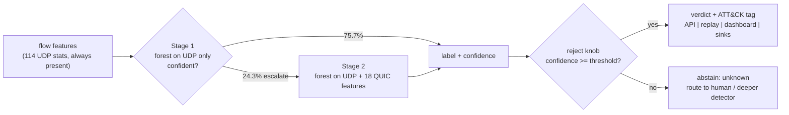

# FlowSentry

Per-flow hierarchical UDP/QUIC intrusion detection with a tunable reject option, served over
FastAPI. It operationalizes the architecture from my accepted **SECRYPT 2026** paper on hierarchical
UDP/QUIC intrusion detection, on that paper's own public dataset.

**The numbers, all measured and reproducible from this repo:**

- Binary DDoS detection **PR-AUC 0.9767** on a connection-grouped, leakage-safe held-out split of
  the real BCCC-UDP-QUIC-IDS-2025 dataset. `make reproduce` retrains and fails unless
  `artifacts/metrics.json` regenerates **byte-identically**.
- The reject knob moves reliability from **83.2%** (answer every flow) to **99.3%** (answer the
  ~65% the model is sure about), with the whole coverage-reliability curve measured, not asserted.
- Stage 1 answers **75.7%** of flows from cheap always-present UDP statistics. That is the paper's
  design, and this repo **measured what it buys and published the unflattering answer**: on this
  sample, a single 60-tree forest on the joint space is faster than the two-stage hierarchy, scores
  the highest macro-F1 of any arm, and beats it on binary PR-AUC, at a cost of 0.0006 lower accuracy
  (0.8311 vs 0.8317). See [the ablation](#ablation-what-the-hierarchy-actually-buys).
- Scoring: **2.4 ms** mean per single flow (p95 5.6 ms), **~125,000 flows/s** batch on the full
  25,615-flow sample (dev machine, environment recorded in `artifacts/benchmark.json`).

> **Data note, read this first.** Every number here is measured on the **real
> BCCC-UDP-QUIC-IDS-2025 dataset** (CC BY 4.0), the dataset from my SECRYPT 2026 paper. Flows were
> extracted from cloud PCAP captures by my own analyzers, **UDPFlowLyzer** (UDP flow statistics)
> and **QUICFlowLyzer** (QUIC metadata). The repo ships a **stratified sample of the public
> dataset** (`data/sample/bccc_udp_quic_sample.csv.gz`, 25,615 flows) so the whole pipeline
> reproduces from a clean clone without the multi-GB download. This is a per-flow classification
> service, not a live network tap: it classifies stored flow records.

## Quickstart (cold clone to scoring)

```bash
git clone https://github.com/Aeripsen/flowsentry
cd flowsentry
python -m venv .venv
source .venv/bin/activate        # Windows: .venv\Scripts\activate
pip install -e ".[dev]"          # package + runtime deps + test tooling

python -m flowsentry.train      # trains on the committed BCCC sample, writes artifacts/ (~30 s)
pytest                          # 46 tests
uvicorn flowsentry.service:app  # serve on http://localhost:8000
```

```bash
curl -s -X POST http://localhost:8000/predict \
  -H "Content-Type: application/json" \
  -d '{
        "features": {"pkt_count": 1240, "byte_count": 1785600, "pps": 41300,
                     "bps": 4.76e8, "avg_pkt_size": 1440, "mean_iat": 2.4e-5,
                     "directional_asymmetry": 1.0, "has_quic_subflow": 0},
        "reject_threshold": 0.9
      }'
```

Docker is self-contained (trains inside the build from the committed sample, so a clean clone
always gets a working `/predict`):

```bash
docker build -t flowsentry . && docker run -p 8000:8000 flowsentry
docker compose up --build       # API on 8000 + dashboard on 8501
```

## Why a reject option

Most IDS demos report one accuracy number and answer every flow, confident or not. In a SOC that is
exactly wrong: a low-confidence guess on a rare attack family is worse than an honest "unknown,
send to a human or a deeper detector." FlowSentry makes that trade-off a tunable, measured knob:
sweep the reject threshold and you get a coverage-vs-reliability curve instead of a single number.
The curve is the product; the risk control is what separates this from a generic classifier demo.

## Architecture



The component map with the scoring path, the extension seams (each with two real implementations in
the repo), and the measured performance model is in
[docs/ARCHITECTURE.md](docs/ARCHITECTURE.md). The load-bearing decisions and their rejected
alternatives are ADRs: [docs/adr/](docs/adr/) covers the two-stage design, the grouped split,
PR-AUC as the headline, the request-time reject knob, artifact/data shipping, config vs schema, the
sequential scoring fast path, and what infrastructure was deliberately not built.

## Feature sets (defensible by name, not a positional slice)

- **Stage 1 (UDP-only), 114 features** from UDPFlowLyzer: packet/byte counts, `pps`/`bps` rates,
  inter-arrival-time statistics (`mean_iat`, `iat_std`, `iat_entropy`, ...), burst/idle structure,
  packet-size distribution moments and percentiles, entropy features, and directional asymmetry.
  Cheap and present on *every* UDP flow, which is why Stage 1 can answer most flows alone.
- **Stage 2 (UDP + QUIC), 132 features**: the 114 UDP features plus 18 QUICFlowLyzer features
  (`has_quic_subflow`, `quic_*` handshake/timing/path-migration signals). The exact names are in
  `src/flowsentry/data.py` (`UDP_FEATURES`, `QUIC_FEATURES`). Ports and IPs are deliberately
  **excluded** from the model to avoid trivial shortcuts; they only build the connection key for
  the leakage-safe split.

## Results (real, measured)

Dataset: BCCC-UDP-QUIC-IDS-2025, the committed 25,615-flow stratified sample (benign + 7 named UDP
DDoS families; all rare-family flows kept, benign and UDP-RAW capped). **Leakage-safe split:**
`GroupShuffleSplit` on the UDP 5-tuple connection, so no flow from one connection appears in both
train and test; the median imputer is fit on train only.

**How much does the grouping buy on this sample? Honestly, little, and that is measured.**
`python scripts/split_comparison.py` runs both splits head to head and writes
`artifacts/split_comparison.json`: binary PR-AUC is identical (0.9767 either way), accuracy differs
by four ten-thousandths (grouped 0.8317, stratified 0.8321), and macro-F1 is actually higher under
the grouped split (0.3911 vs 0.3714). The reason is the sample averages 1.4003 flows per connection,
so there is almost nothing for grouping to hold together. It is the correct method and stays, but on
this balanced sample it is hygiene, not a measurable score-inflation guard. The deeper axis cannot be
tested inside this dataset: UDP-RAW comes from only **2 source IPs**, and **85.24%** of test flows
share a source IP with training, so the near-perfect UDP-RAW PR-AUC is "recognize the same
campaign," not "detect a new flood." Details in [ADR 002](docs/adr/002-connection-grouped-split.md)
and the model card's limitations.

**Binary DDoS detection (benign vs attack), PR-AUC = 0.977.** Benign-detection PR-AUC = 0.954.
**Full-coverage accuracy = 83.2%, macro-F1 = 0.391** across the 8 classes.

Per-family (PR-AUC / F1 on the test split):

| Class | PR-AUC | F1 |
|---|---|---|
| UDP-RAW | 0.999 | 0.995 |
| benign | 0.954 | 0.820 |
| UDP-VSE | 0.426 | 0.481 |
| UDP-MULTI | 0.306 | 0.358 |
| UDP-HULK | 0.147 | 0.242 |
| UDP-GAME | 0.082 | 0.164 |
| UDP-OVH | 0.045 | 0.027 |
| UDP-bypass-v1 | 0.042 | 0.041 |

The dominant flood (UDP-RAW) and benign traffic separate cleanly; the rare campaign variants
(200-400 flows each, all volumetric UDP floods that look alike at the flow level) are genuinely
hard, which is why full-coverage macro-F1 is modest. That is the honest picture, and the reject
option is the engineering answer to it: abstain on the uncertain rare-flow tail instead of bluffing.

**Coverage vs reliability (the reject knob working).** Reliability = accuracy on the flows the
model chose to answer. Stage 1 escalates 24.3% of flows to Stage 2.

| Reject threshold | Coverage | Reliability | Flows answered |
|---|---|---|---|
| 0.00 | 100.0% | 83.2% | 6,570 |
| 0.50 | 87.6% | 93.6% | 5,752 |
| 0.70 | 81.9% | 97.5% | 5,379 |
| 0.80 | 79.2% | 98.1% | 5,202 |
| 0.90 | 76.6% | 98.6% | 5,035 |
| 0.95 | 73.0% | 99.0% | 4,793 |
| 0.99 | 64.8% | 99.3% | 4,255 |

### Ablation: what the hierarchy actually buys

Short answer, measured: **not much, and this repo says so rather than implying otherwise.** The
two-stage hierarchy is the architecture from the paper and it is the repo's central design claim, so
it gets the same treatment as everything else here: `python scripts/hierarchy_benchmark.py` measures
it and writes `artifacts/hierarchy_benchmark.json`.

| Arm | Accuracy | Macro-F1 | Binary PR-AUC | Serving ms/flow |
|---|---|---|---|---|
| stage1_only (60 trees, UDP only) | 0.8306 | 0.3794 | 0.9764 | 1.595 |
| single_joint (200 trees, UDP+QUIC) | 0.8317 | 0.3911 | 0.9774 | 5.010 |
| single_joint_small (60 trees, UDP+QUIC) | 0.8311 | **0.3946** | 0.9771 | **1.388** |
| hierarchy (shipped) | 0.8317 | 0.3911 | 0.9767 | 2.597 |

A single **60-tree** forest on the joint space is faster than the hierarchy on both the serving and
batch paths, scores the highest macro-F1 of any arm, and beats it on binary PR-AUC, with one model
and no escalation threshold. The hierarchy only beats the *200-tree* joint model, which is the
baseline the ADR happened to pick and not the one a person would choose. The reject knob does not
rescue it either: all four arms give the same coverage-reliability curve within noise, and at
threshold 0.99 both joint models answer more flows at higher reliability than the hierarchy.

The hierarchy stays because operationalizing the paper's architecture is what this repo is for, and
because the escalation rate is a genuine monitoring signal. Its one open argument is a deployment
that defers QUIC extraction to the 24.3% of flows that escalate. The benchmark prices that properly:
it leaves the QUIC extraction cost symbolic (this repo cannot measure it, the extractors are upstream)
and reports the break-even it would have to clear. [ADR 001](docs/adr/001-two-stage-hierarchy.md) has
the whole accounting, including why the accuracy tie is exact rather than close.

**Confidence calibration was measured, not assumed:** isotonic calibration fixes the meaning of the
confidence number (ECE 0.041 to 0.008) but cannot improve the curve (a monotone map cannot re-rank
flows), so the knob ships on raw confidence with the measured curve as the operating guide. The
experiment and the shipping trade-off are in the [model card](docs/MODEL_CARD.md);
`scripts/calibration_experiment.py` reruns it.

Source: `artifacts/metrics.json`, regenerated by every training run. Full detail and limitations in
[docs/MODEL_CARD.md](docs/MODEL_CARD.md).

## Latency and throughput (measured)

`python -m flowsentry.bench` benchmarks the scoring path on real flows and writes
`artifacts/benchmark.json` with the environment it ran on (the committed file is from the dev
machine: 12-core Windows, Python 3.13, scikit-learn 1.9). Measured there:

| Path | Result |
|---|---|
| single flow, serving path (`/predict` cost) | mean 2.4 ms, p50 1.3 ms, p95 5.6 ms, p99 6.0 ms (~415 flows/s sequential) |
| batch, 8,192 flows | ~60,000 flows/s |
| batch, whole 25,615-flow sample | ~125,000 flows/s |

The p95/p99 tail is real: it contains the flows that escalate to Stage 2. An earlier version of
this service scored ~22 flows/s; profiling showed the cost was not the model but sklearn
re-spawning a joblib thread pool inside every single-row `predict_proba` call. The fix
(`scoring.py` + [ADR 007](docs/adr/007-sequential-scoring-path.md)) walks the trees sequentially,
which a test asserts is bit-identical to the native path, and switches to the threaded path for
large batches. The pre-fix path is still measured by the benchmark (`single_row_native_pool`,
mean 44.7 ms/flow) so the comparison stays reproducible. These are stored-flow scoring numbers on one
machine, not a live tap under concurrent load; a proper load test is roadmap. A perf regression
test fails CI if the per-call pool behavior ever comes back.

## API

| Endpoint | Method | What it does |
|---|---|---|
| `/health` | GET | liveness only, always 200 while the process is up |
| `/ready` | GET | readiness: **503 until a trained model is loaded** |
| `/predict` | POST | classify one flow, reject knob as a request field |
| `/predict/batch` | POST | classify up to 4,096 flows in one vectorized call |
| `/curve` | GET | the measured coverage-vs-reliability curve from the last train run |

The response has four fields: `label` (one of the 8 classes, or `unknown` when the model abstains),
`confidence`, `escalated_to_stage2`, and `abstained`. Feature values must be finite numbers
(strings and NaN/Infinity are rejected with 422); missing UDP features are median-imputed; missing
QUIC features default to 0 (no QUIC subflow observed). Every scored request emits one structured
JSON log line.

## Replay, drift, dashboard

```bash
python -m flowsentry.stream --n 2000                 # per-flow replay, honest serving latency
python -m flowsentry.stream --n 0 --batch            # whole sample in one vectorized call
python -m flowsentry.stream --n 3000 --drift         # PSI per feature vs the training distribution
python -m flowsentry.stream --n 2000 --jsonl out.jsonl   # alert sink for a SIEM/jq to tail
```

Alerts carry the MITRE ATT&CK mapping (class-level, a triage hint; every family in this dataset is
a volumetric flood, so they map to T1498.001, stated plainly in `attack_map.py`). Drift detection
compares per-feature distributions of a scored window against a reference persisted at training
time; see `drift.py` for the mechanics and its stated blind spot.

`dashboard/app.py` is a Streamlit dashboard whose centerpiece is the reject-threshold slider: move
it and the coverage-vs-reliability tradeoff recomputes live from the trained model on the full
held-out test split (the same leakage-safe split the model card reports). Below it: measured live
inference, alerts by family, the alert feed with ATT&CK tags, and the curve.

```bash
python -m flowsentry.train          # need a trained artifact first
pip install streamlit               # dashboard-only dependency
streamlit run dashboard/app.py
```

No screenshot or GIF is committed yet; capturing one is a manual follow-up for whoever publishes
the repo.

## Configuration

Defaults live in code (`src/flowsentry/config.py`) and are the exact values every reported number
was measured with; a test pins them. Overrides: environment variables
(`FLOWSENTRY_TRAINING__SEED=7`) beat an optional `flowsentry.yaml`
(template: `flowsentry.example.yaml`) beat the defaults. Unknown keys fail the run instead of
training a silently different model. The feature schema is deliberately not configurable
([ADR 006](docs/adr/006-config-vs-schema.md)). Swapping the stage estimator is one config value
(`stage_estimator: hist_gradient_boosting`); the registry proves the seam with a test that runs the
full pipeline on every registered family.

## Reproducing the numbers

```bash
make reproduce            # or: python scripts/reproduce.py
```

Retrains from the committed sample and fails unless `artifacts/metrics.json` regenerates
**byte-identically** (seeded end to end: split, imputer, forests). Exact bytes are promised under
`requirements.lock` (the environment the published numbers came from); on other versions the test
suite still enforces the PR-AUC floor. `ruff check`, `mypy`, and `pytest -q` (46 tests, including
the leakage guard, the metrics regression, exact-equality guards on both fast paths, and the perf
regression guard) run in CI.

## Roadmap (honest)

- [ ] Public deploy with a live URL + a dashboard screenshot/GIF in this README
- [ ] Train on a larger slice of the full dataset and report those numbers alongside these
- [ ] Load test under concurrent HTTP traffic (the benchmark measures scoring, not the ASGI stack)
- [ ] Adversarial probe: perturbed flows vs the reject knob (designed in
      [docs/THREAT_MODEL.md](docs/THREAT_MODEL.md))
- [ ] Cross-day / cross-dataset evaluation for host and campaign generalization. This is the one
      that would decide whether UDP-RAW's 0.9986 PR-AUC is detection or campaign recognition, and it
      is **blocked on the shipped sample**: `scripts/build_sample.py` drops `timestamp` along with
      the other identifier columns, so the committed 25,615 flows carry no day field to split on.
      Doing it honestly means rebuilding the sample from the full dataset with the timestamp kept,
      not inventing a split from what ships here.

## Attribution

- The two-stage hierarchical UDP/QUIC IDS with a reject option is the architecture from my
  peer-reviewed paper, accepted at **SECRYPT 2026** (Jafari, Shafi, Habibi Lashkari; I am first
  author). This repo is that idea turned into a running, testable service.
- **UDPFlowLyzer** and **QUICFlowLyzer** (the feature layer) are my own public flow extractors,
  built on the **NTLFlowLyzer** base by MohammadMoein Shafi.
- **BCCC-UDP-QUIC-IDS-2025** is the public (CC BY 4.0) dataset from the same paper, produced at the
  Behaviour-Centric Cybersecurity Center (BCCC), York University. Only a stratified sample of the
  released dataset is redistributed here, with attribution; no non-public data is included.
- Built with scikit-learn, pandas, FastAPI, pydantic, and pydantic-settings.

## License

MIT for the code, see [LICENSE](LICENSE). The bundled data sample is CC BY 4.0 (BCCC-UDP-QUIC-IDS-2025).
