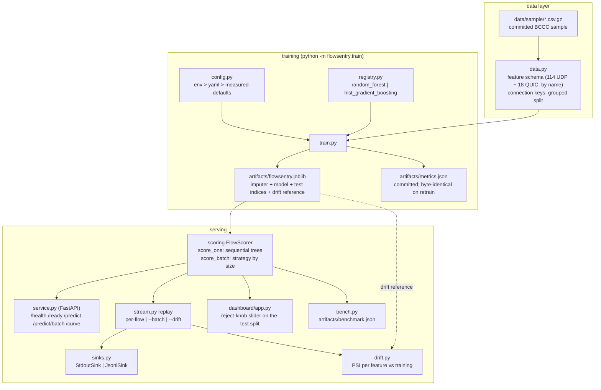

# Architecture

FlowSentry is one Python package with four scoring surfaces (API, batch replay,
dashboard, benchmark) sharing one scoring path. The design decisions and their
rejected alternatives live in [docs/adr/](adr/); this page is the map.

## Components

## The scoring path (the part that had to be fast)

Every surface goes through `FlowScorer`, so single-row and batch scoring cannot
drift apart (a test asserts they agree row for row):

1. `row_from_features` builds the 132-column row in schema order: missing UDP
   features become NaN, missing QUIC features become 0.
2. Imputation applies the fitted medians directly (exactly equal to
   `SimpleImputer.transform`, asserted by a test).
3. The two-stage model scores: Stage 1 on the UDP columns; flows below the 0.90
   escalation confidence rerun on Stage 2 (UDP+QUIC). Below the measured batch
   cutoff the trees are walked sequentially (bit-identical, no thread-pool
   spin-up, ADR 007); above it the native threaded path wins.
4. The reject knob compares final confidence to the request's threshold and
   returns `unknown` instead of a low-confidence label.

Measured on the dev machine (artifacts/benchmark.json records the environment):
single flow mean 2.4 ms / p95 5.6 ms; batch ~125k flows/s on the full sample.

## Extension points, each with two real implementations today

| Seam | Contract | Implementations in-repo |
|---|---|---|
| stage estimator | `registry.StageClassifier` (fit / predict_proba / classes_) | random_forest, hist_gradient_boosting |
| feature sets | named lists in `data.py` | UDP (stage 1), UDP+QUIC (stage 2) |
| alert sink | `sinks.AlertSink` (emit / close) | StdoutSink, JsonlSink |
| scoring strategy | `sequential` flag in `model.forest_proba` | sequential walk, native threaded |

Seams with one hypothetical implementation were deliberately not built; the list
of what was cut and why is ADR 008.

## Evidence files (committed, regenerated by tooling)

- `artifacts/metrics.json`: the model's numbers; `make reproduce` retrains and
  fails unless the file regenerates byte-identically.
- `artifacts/benchmark.json`: latency/throughput with the environment recorded,
  including the pre-fix path so the speedup stays reproducible.
- `artifacts/calibration_experiment.json`: why the reject knob runs on raw
  confidence (measured ECE and matched-coverage reliability).
